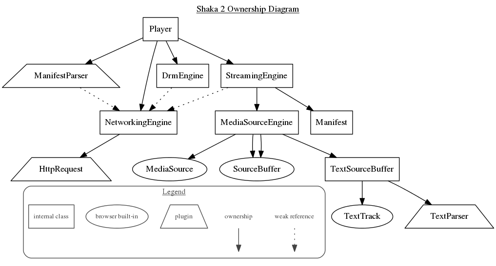
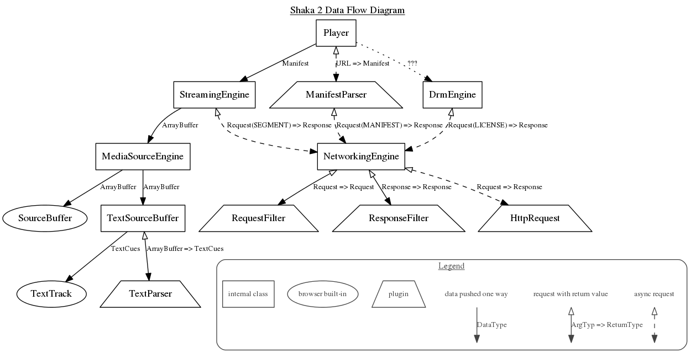

# Shaka v2.0 Redesign

last update: 2015-11-02

by: [joeyparrish@google.com](mailto:joeyparrish@google.com)

## Objective

We are redesigning Shaka Player to reduce overall complexity, increase
modularity, and make it easier to introduce new features that would be too
messy in Shaka Player v1.x.  We are<em> targeting</em> a preview branch on github by the end of November 2015 and hope to have a
fully-functional public beta release in January 2016.

## Background

Shaka Player v1.x has been very successful, but new features are becoming more
difficult to add and old features are becoming difficult to maintain.  What
started as a simple design has gotten more complex over its first year, and
minor design flaws have been exacerbated.

## Issues in Shaka Player v1.x

Existing features in Shaka are [difficult](https://github.com/google/shaka-player/commit/671611ef3722169b9f6b51ab44bdd6b4098d959e) [to](https://github.com/google/shaka-player/commit/603fae969550c69ea38a61249da905857c67b9f1) [exclude](https://github.com/google/shaka-player/commit/f248647685b92ba928bbfd06d45d2b99023d60c2), often requiring [multiple](https://github.com/google/shaka-player/commit/39be45d3d55cdcef20a6a529a87246b0ea11cb33) [fixes](https://github.com/google/shaka-player/commit/6fe239150a8939728876e93e1a4269032530d9f1) to get certain dependencies removed.  This means users all end up using the
same monolithic player library.  Features in Shaka 2 should be modular and easy
to exclude from the build.

Some operations, in particular [starting playback and filling the buffer](https://groups.google.com/forum/#!topic/shaka-player-users/Icvx6ymGyEs), take longer than they need to.  Startup and buffering in Shaka 2 should be as
low-latency as possible without complicating the code.

The system of [StreamVideoSource](https://github.com/google/shaka-player/blob/v1.5.x/lib/player/stream_video_source.js), [Stream](https://github.com/google/shaka-player/blob/v1.5.x/lib/media/stream.js), and [SourceBufferManager](https://github.com/google/shaka-player/blob/v1.5.x/lib/media/source_buffer_manager.js) in Shaka 1 involves a lot of code and is difficult to synchronize, which [prevents us from updating MediaSource duration](https://github.com/google/shaka-player/blob/v1.5.1/lib/player/stream_video_source.js#L1807) and makes it [difficult to set initial playback time](https://github.com/google/shaka-player/issues/101) on browsers other than Chrome.  Shaka 2 should have a simpler streaming core
that works better across browsers.

[Buffering state](https://github.com/google/shaka-player/blob/v1.5.1/lib/player/player.js#L994) in Shaka 1 involves coordination between several layers (from [Player](https://github.com/google/shaka-player/blob/v1.5.x/lib/player/player.js) to [Stream](https://github.com/google/shaka-player/blob/v1.5.x/lib/media/stream.js)) and has been [difficult](https://github.com/google/shaka-player/issues/44) [to](https://github.com/google/shaka-player/issues/63) [get](https://github.com/google/shaka-player/issues/127) [right](https://github.com/google/shaka-player/issues/221#issuecomment-152781243).  Buffering state in Shaka 2 should be simple and consistent.

Shaka 1 relies on the browser to implement support for text types, and is
therefore limited to non-segmented WebVTT.  Shaka 2 should also support [segmented text types](https://github.com/google/shaka-player/issues/150) and [types not natively supported by the browser](https://github.com/google/shaka-player/issues/111).

Bandwidth estimation in Shaka 1 relies on the assumption that segments are not
cached locally.  Use of [cache-busting techniques](https://github.com/google/shaka-player/blob/v1.5.1/lib/util/ajax_request.js#L241) to enforce this makes Shaka very [cache](https://github.com/google/shaka-player/issues/76)-[unfriendly](https://github.com/google/shaka-player/issues/191).  Shaka 2 should be cache-friendly.

Shaka 1 [uses HTTP headers to synchronize the user's clock](https://github.com/google/shaka-player/blob/v1.5.1/lib/util/ajax_request.js#L448) with the server.  This is [error-prone for some CDNs](https://github.com/google/shaka-player/issues/205) and also raises [CORS issues](https://github.com/google/shaka-player/issues/159), so Shaka 2 should avoid using HTTP headers.

[HttpVideoSource](https://github.com/google/shaka-player/blob/v1.5.x/lib/player/http_video_source.js) does not build on MSE and classes like EmeManager have special cases to
support it.  Since it was originally created for debugging purposes, Shaka 2
should drop HttpVideoSource and only support MSE-based playback.

Integration tests using externally-hosted resources [can be flaky](https://groups.google.com/forum/#!searchin/shaka-player-users/test/shaka-player-users/rftylXoq0N4/b8_ijGYckUkJ), especially when run outside of Google's network.  Shaka 2 should avoid tests
that depend on external resources or network conditions.

Error reporting is inconsistent in Shaka 1.  The format of error events varies,
and application developers sometimes [have to use error message strings](https://github.com/google/shaka-player/issues/201) hard-coded into the library.  Shaka 2 should have a consistent error format
that is easy to read.

Networking abstractions in Shaka 1 are built inside of AjaxRequest, which
requires non-HTTP requests to [pretend to come from XmlHttpRequest](https://github.com/google/shaka-player/blob/v1.5.1/lib/util/ajax_request.js#L305).  The networking abstraction in Shaka 2 should be simpler and should not treat
XHR as the basis for all networking.

A developer who wishes to use a custom network protocol or a custom manifest
format in Shaka 1 will have to modify the library to do so.  Shaka 2 should [support external plugins for networking](https://github.com/google/shaka-player/issues/198) and manifest support.

The functionality that can be injected into Shaka 1 ([IBandwidthEstimator](https://github.com/google/shaka-player/blob/v1.5.1/lib/util/i_bandwidth_estimator.js), [IAbrManager](https://github.com/google/shaka-player/blob/v1.5.1/lib/media/i_abr_manager.js)) is based on implementing class interfaces, which can be complex for those
unfamiliar with the Closure compiler.  Plugins and extensions to Shaka 2 should
be as simple as possible.

[Static members](https://github.com/google/shaka-player/issues/126) in Shaka 1 make it impossible in some cases to host multiple Player instances
with different settings.  Player instances should be completely independent in
Shaka 1.

## Shaka v2 Design Principles

Modularity: make it easy to exclude what you don't need

Extensibility: make it easy to add what we didn't give you

Portability: minimize assumptions about browser behavior

Latency: parallelize operations whenever feasible

Simplicity: organize classes to minimize and isolate complexity

Independence: instances of Player should not affect one another's state

## New Ideas

<strong>[Extensibility]</strong> Shaka 2 will expose a system of plugins to allow extensions and modifications
of core behavior.  Internally-implemented features (such as support for HTTP
requests or DASH manifests) will be implemented as plugins as well.

<strong>[Modularity]</strong> Built-in plugins (HTTP, DASH, etc) will register themselves at load-time.  In
this way, excluding a class from the build excludes that feature and all of its
dependencies.

<strong>[Portability]</strong> Rather than assume how browsers will implement eviction in MSE, we will start
clearing data from SourceBuffers once the playhead has moved.  The amount of
data left in buffer for backward seeking will be configurable.

<strong>[Simplicity]</strong> All MSE functionality (MediaSource and all SourceBuffers) will be isolated to
one object called MediaSourceEngine.  All MSE operations will be wrapped in
Promises, and synchronization will be handled internally.

<strong>[Simplicity]</strong> StreamVideoSource and Stream will be replaced by StreamingEngine.
StreamingEngine will own MediaSourceEngine, and will be responsible for reading
an internal representation of a manifest, fetching content, and feeding content
to MediaSourceEngine.

<strong>[Simplicity]</strong> To simplify segmented text and non-native text formats, we will create a
work-alike for SourceBuffer called TextSourceBuffer.  MediaSourceEngine and the
layers above it will not have to know the details of how text is handled, and
segmented text can be streamed exactly the same way as segmented audio and
video.

<strong>[Extensibility]</strong> Text parsers will be plugin-based, allowing new text formats to be supported
without modifying the library.

<strong>[Simplicity]</strong> To avoid complicating StreamingEngine, it will be agnostic to live vs VOD
content.  The internal representation of a manifest will only contain available
segments.

<strong>[Extensibility]</strong> As much as possible, plugins will be simple callbacks rather than class
interfaces.  All structured input will be in the form of anonymous objects.

<strong>[Extensibility, Simplicity]</strong> Manifest support will be plugin-based.  A manifest plugin will be responsible
for fetching manifests, parsing manifests, and in the case of live content,
updating manifests and segment indexes.  Updates to the manifest will be made
unilaterally by the parser, without involving StreamingEngine.

<strong>[Simplicity]</strong> Loading a manifest in the Player will invoke an auto-detecting parser.  This
default parser will determine which parser plugin is appropriate and delegate
to it.  This simplifies the basic playback API to a single step.

<strong>[Simplicity]</strong> Distribute support tests through each component.  Player can test for browser
support in a hierarchical way by querying each component.  This provides a more
detailed view of feature support from the library and removes the need for the
separate browser support test in Shaka 1.

## Architecture Diagrams

## Rough Sample APIs

shaka.Player(videoElement)

shaka.Player.prototype.configure({})

shaka.Player.prototype.getConfiguration() => {}

shaka.Player.prototype.load(manifestUri, opt\_startTime, opt\_manifestParser)
=> Promise

shaka.Player.prototype.unload() => Promise

shaka.Player.prototype.destroy() => Promise

shaka.Player.prototype.trickPlay(rate)

shaka.Player.prototype.cancelTrickPlay()

shaka.Player.prototype.isLive() => boolean

shaka.Player.prototype.getTracks() => []

shaka.Player.prototype.selectTrack(Track)

shaka.Player.prototype.getNetworkingEngine() => NetworkingEngine

shaka.Player.support() => {}

shaka.net.NetworkingEngine.registerScheme(schemeId, requestCallback)

shaka.net.NetworkingEngine.prototype.registerRequestFilter(filterCallback)

shaka.net.NetworkingEngine.prototype.registerResponseFilter(filterCallback)

shaka.net.NetworkingEngine.prototype.configure({})

shaka.media.TextSourceBuffer.registerParser(mimeType, parserCallback)

shaka.manifest.ManifestParser.registerParser(mimeType, fileExt, parserCallback)

## TODO

  * Internal manifest format needs to be specified.
  * NetworkingEngine needs implementation.  <em>(in progress)</em>
  * StreamingEngine needs implementation.  <em>(blocked on NetworkingEngine)</em>
  * TextParser for WebVTT needs implementation.
  * Manifest parser callback needs to be specified.
  * DashManifestParser needs implementation.  <em>(blocked on manifest format & callback)</em>
  * DrmEngine needs design work.
  * Player needs implementation.  <em>(blocked on everything else)</em>
  * Preview branch needs to be created on github.

